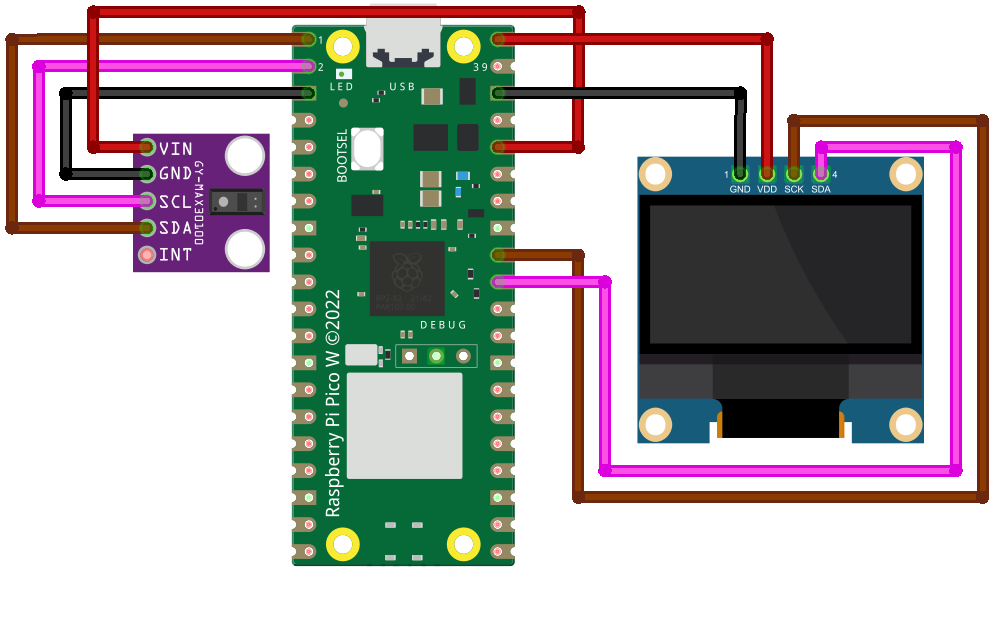

# PiPO2
The PiPO2 is a Pulseoxymeter running on a Raspberry Pi Pico 2W. It uses a MAX30102 to detect a patients Heart Rate & Oxygen Saturation and sends the data via the MQTT Protocol.
It can also display said data on an optional SSD1306 OLED Screen.

Data will be sent via MQTT when the Sensor is able to get readings (when the sensor is attached to a finger). If it's unable to get a reading, no data will be sent (and the screen won't update either).

Heart Rate can freak out sometimes, but most of the time it has the same value as my Garmin Watch. For SpO2 the default formula gave me impossible values, the others were all in 3% range of each other.

## Requirements
### Hardware
- Raspberry Pi Pico 2W (Pico 1W not tested)
- MAX 30102 Sensor (MAX 30105 not tested)
- SSD1306 OLED Display (optional; code requires edits if not in use)

### Software
- Python 3.8 or later
- Thonny or another IDE capable of sending Code to the Pico
- Raspberry Pi Pico with Micropython 1.25.0 or later

### Used Packages
- MAX30102 Driver
- UMQTT
- SSD1306 Driver

How to Install:
- Connect Pico to Internet
- `import mip`
- `mip.install("github:n-elia/MAX30102-MicroPython-driver")`
- `mip.install("umqtt.simple")`
- `mip.install("ssd1306")`

## How to Run
- Enter WiFi Details in `wifi.py`
- Enter MQTT Broker Details in `mqtt.py`
- Copy all Files to a Pico with MicroPython
- Install Required Packages

## Other Information
- STL Models for a basic housing can be found in the housing folder (requires velcro strips or similiar to wrap around arms)
- Uses Code from [dkallen78's project](https://github.com/dkallen78/PulseOximeter/blob/main/pulse-oximeter.py)

Developed with Thonny w/ Python 3.8.10 and a Raspberry Pi Pico 2W w/ RP2350 and MicroPython 1.25.0  
MAX30102 Housing designed with Autodesk Inventor and Blender  
The Pico and SSD1306 Housing is a modified version of [this model](https://makerworld.com/en/models/514436-pi-pico-case-with-ssd1306-oled-slo), (I increased the height and added the loops for the velcro straps)  
Housings printed on a Creality Ender 3S w/ Klipper